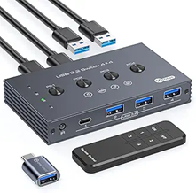
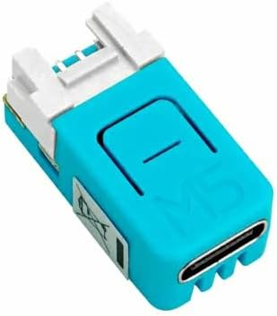

# ESPHome Connection Switcher (Thread)

## Introduction
This is essentially a custom solution to a HDMI2.1 capable KVM that can integrate with a home automation platform like Home Assistant. My household has two gaming PCs that we often want to connect to the living room TV for couch gaming. This project provides the ESP32 ESPHome software and ZHA custom quirk to control an HDMI switch and USB switch with IR to automate this setup.

## The Problem
There are two PCs in my household that can be used for 4K 120hz gaming on the living room TV. Unfortunately, the TV doesn't have enough ports for both and getting everything on the PCs and TV to be setup correctly for a couch gaming session can be a chore.

The ideal solution would let me press a single button and one of the PC would magically connect to the TV with ease. And when someone else wants to use the other PC on the TV, another button press would handle that seamlessly.

## The Setup

### Not Enough HDMI Ports
The first problem to tackle is the insufficient amount of port on the TV. This is commonly remedied using an HDMI switch or KVM. I went with an HDMI switch because I wanted to be able to pick one that only had to be good at one thing rather than comprimising for more features. Also, I chose one with an IR remote so I can easily control it remotely. I ended up with the UGREEN 8K@60 5-in-1 HDMI switch after seeing many others using it specifically for 4K 120hz gaming which was my exact use case.

### Peripheral Connections
Going with a dedicated HDMI switch over a KVM means I no longer had the ability to connect peripherals over USB. Having this would be useful so I didn't have to run back and forth to the PC. For example, I use a USB fingerprint sensor for quick authentication at the couch. I just picked up a generic USB switch that supported an IR remote.

### Automation
With everything described so far, I'm able to use either PCs on my living room TV but it would still require multiple manual steps each time I wanted to use my PC on my living room TV. Both of the switch would have to be independently set to the correct position and the TV would have to be on the correct input. I'm using an ESP32 with the code in this repository to coordinate and automate everything. Specifically, I got the M5Stack NanoC6 because it's tiny, has an IR transmitter to control the two switches, and the ESP32C6 chip on it can connect to my Thread smart home device mesh network instead of Wi-Fi.

This allows me to add everything to Home Assistant as a single logical ESPHome KVM switch where I can write automations against it. For example, I can press a single button on my phone and Home Assistant will command this device to set both switches to the correct position as well as anything that's needed for couch gaming like turning on the PC, turning on the TV, and setting the TV to the right input.

## Current IR Codes
#### HDMI Switch
Address: `0x7F80`
- 1: `nec` - `0xFA05`
- 2: `nec` - `0xF609`
- 3: `nec` - `0xF807`
- 4: `nec` - `0xE41B`
- 5: `nec` - `0xF708`

#### USB Switch
Address: `0x7F80`
- ON: `nec` - `0xED12`
- OFF: `nec` - `0xE11E`
- 1: `nec` - `0xFB04`
- 2: `nec` - `0xF906`
- 3: `nec` - `0xF50A`
- 4: `nec` - `0xE01F`
